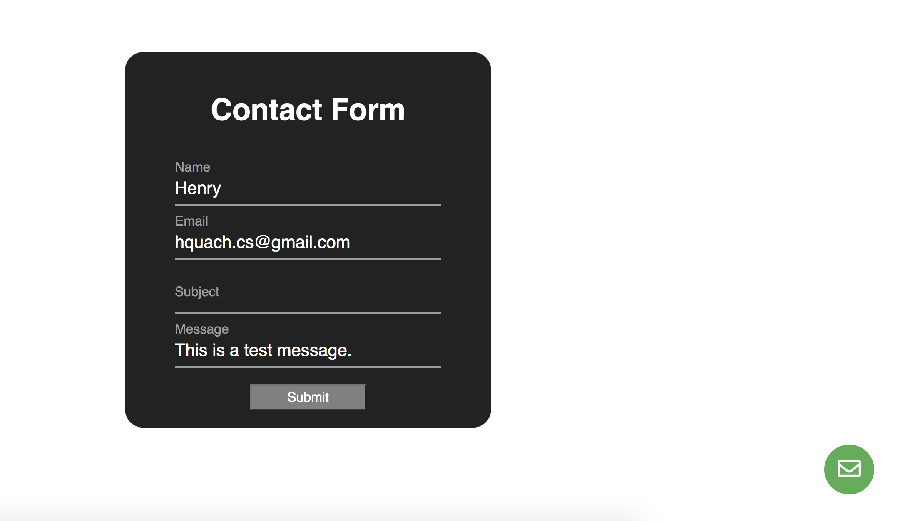
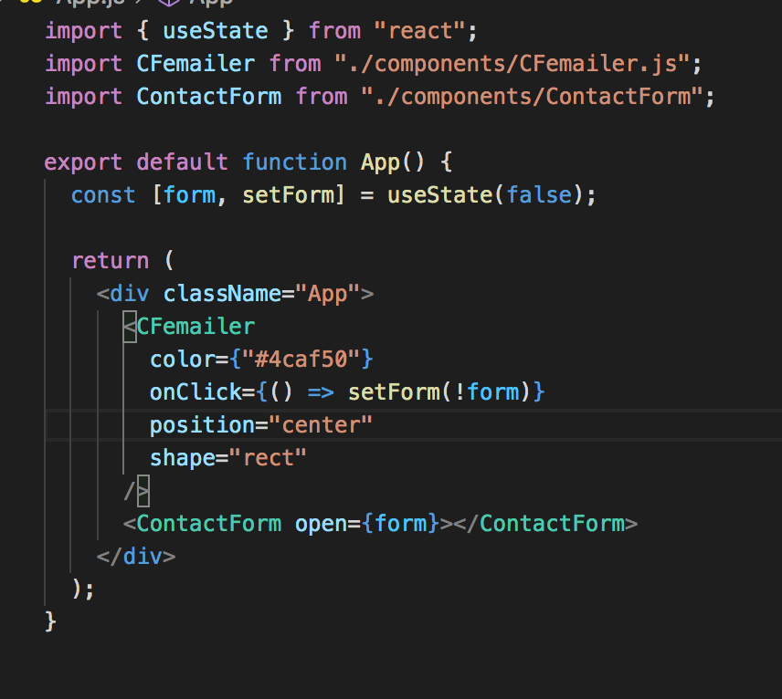
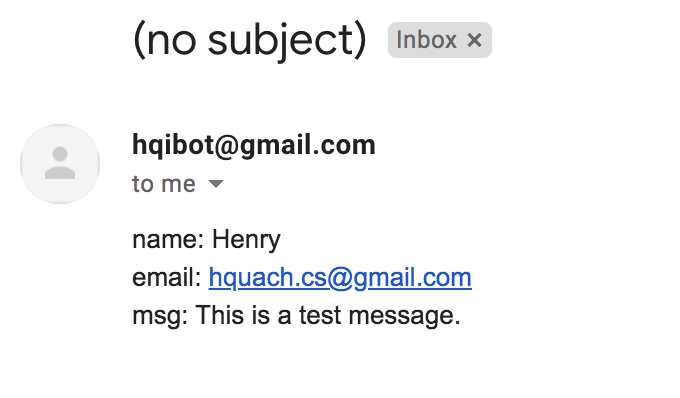

# Contact Form Emailer

This one project is out of many that showcase fundamental skills of react.js, node.js, and express.js. This project is intended to create a contact form button on bottom right that pops a form up. Then take input from user and send that email to a specific email suggested. This component allows user to easily implement in there websites.

## Skills

With this project, I attended to learn some tools/skills for professional use:

- React.js
- HTML5/CSS/JS
- Node.js/Express.js

## Experience

With my background in react.js, this was a simple project that is easy to mess up with. For emailing, I use the Nodemailer module that makes emailing easily given config/env parameters.

<!--   -->

## Future

- Easily implement different option for mailing messages.
